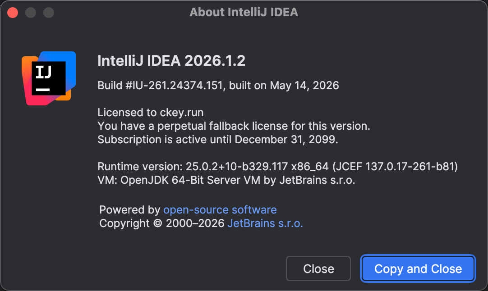
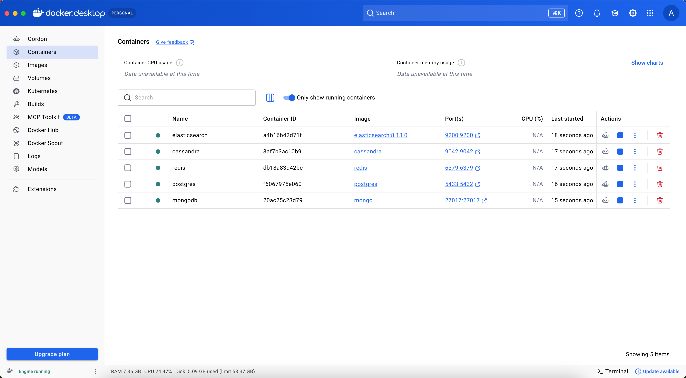
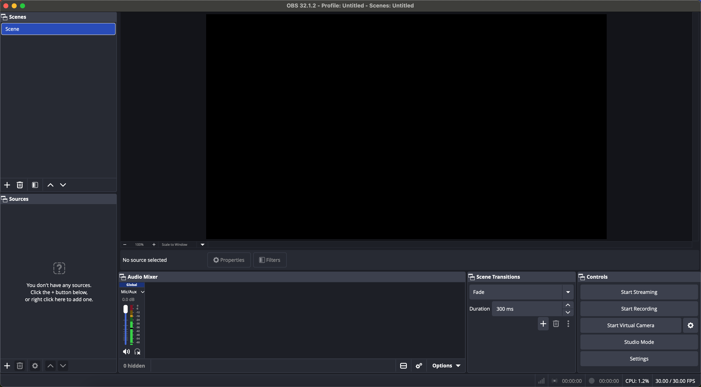
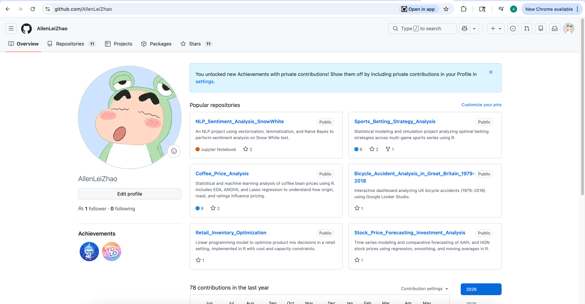
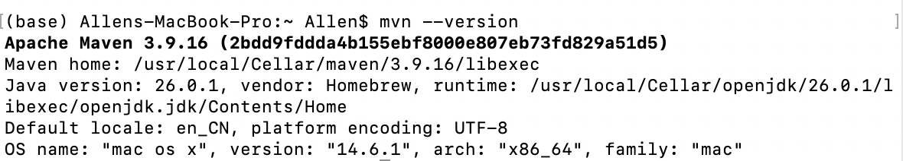
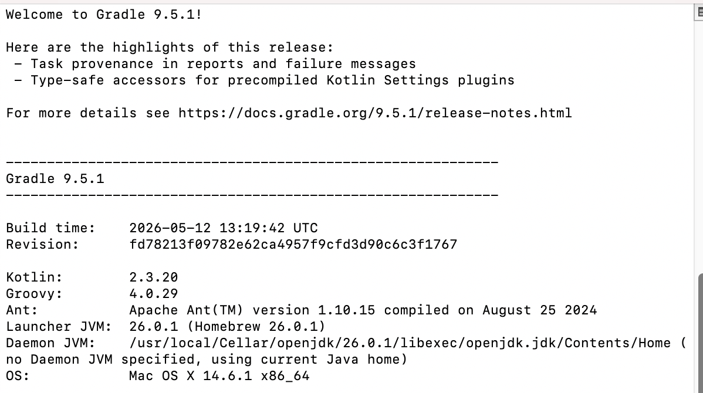
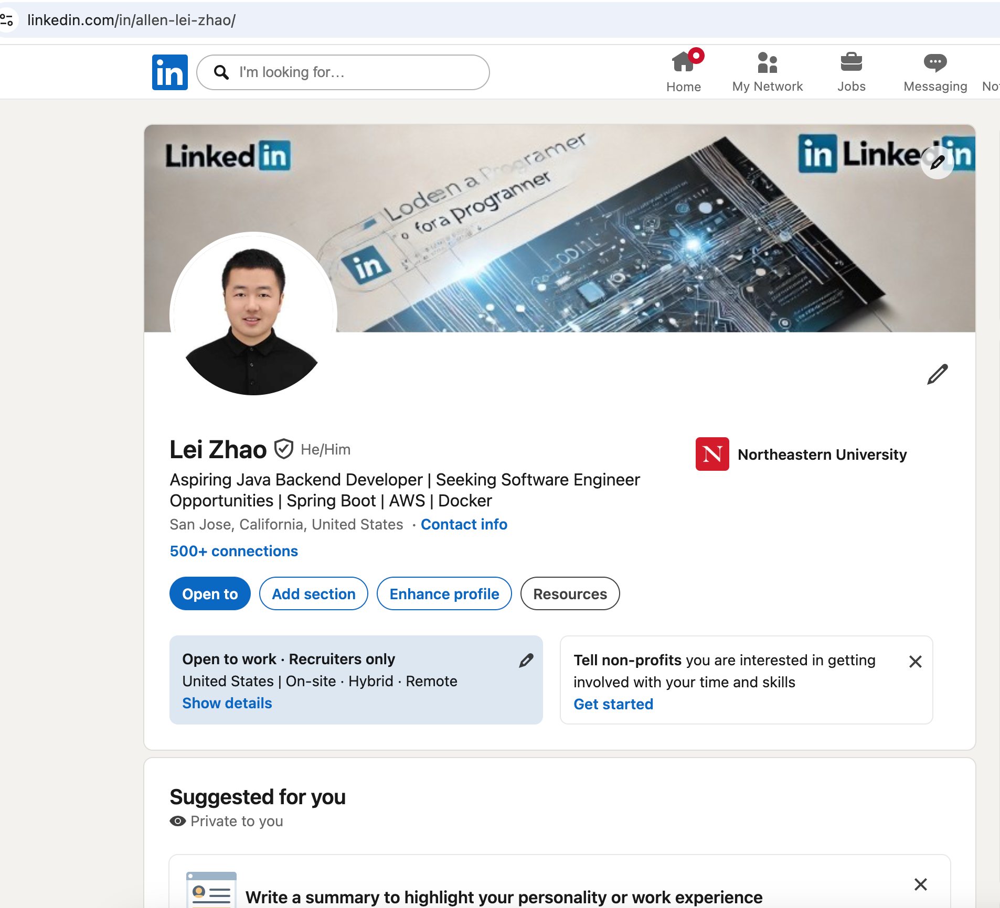
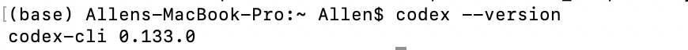

# Day00 - Environment Setup

This document showcases the local development environment configuration completed on May 25, 2026.

## Java 17+

## IntelliJ IDEA Ultimate

## Docker + Containers
Includes PostgreSQL, MongoDB, Redis, Cassandra, and Elasticsearch running via Docker.

## OBS Recording

## Git

## Maven

## Gradle

## AWS S3

## LinkedIn

## Codex CLI
