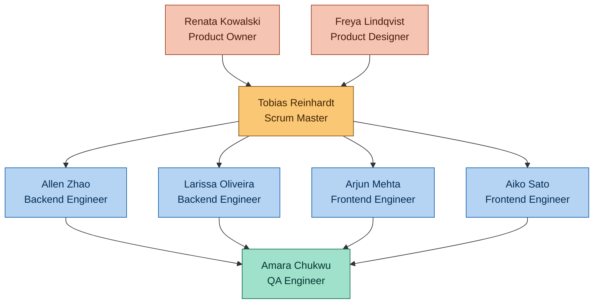

# Build Your Virtual Agile Team

*Product: ShopFlow — a mobile app for shopping, payments, and real-time delivery tracking*

---

## Part 1 — Team Map

ShopFlow is built by one cross-functional Scrum team of 8, organized into four groups: Product & Design, Process, Engineering, and QA.

**Reporting lines:** Everyone reports functionally into the Engineering Manager (outside this team, not pictured). Inside the team itself, nobody 'reports' to anybody — Renata (PO) and Tobias (Scrum Master) are peer roles, not managers of the engineers.

**Closest collaboration:** Allen ↔ Larissa (backend API contracts), Arjun ↔ Aiko (shared component library), Allen/Larissa ↔ Arjun/Aiko (API integration), Freya ↔ Renata (translating requirements into flows before Refinement), Amara ↔ everyone (test cases touch every ticket).

**Go-to person by problem type:**

- Business priority / scope questions → Renata (PO)
- Process, blockers, sprint mechanics → Tobias (Scrum Master)
- Payment service, checkout backend, deployments/AWS → Allen
- Catalog, order service, database design → Larissa
- Mobile UI bugs, cart/checkout screens → Arjun
- Order tracking screen, notifications, app performance → Aiko
- 'Is this ready to ship,' test coverage, regression risk → Amara
- Anything visual, UX flow, design system → Freya

---

## Part 2 — A Day in the Life

It's 9:15 on a Tuesday, second week of our sprint, and I'm refilling my coffee before standup. We're two days out from shipping the new "live delivery map" feature, and I already know today is going to be about that.

At 9:30 Tobias drops the Zoom link and standup starts — fifteen minutes, no more, he's strict about that. We go around in the same order every day: what I did yesterday, what I'm doing today, anything blocking me. Larissa goes first — she finished the order-status webhook yesterday and is picking up a flaky integration test today. I'm next: yesterday I wired the payment service to retry failed transactions with exponential backoff, today I'm finishing the endpoint Aiko needs for the live tracking screen, and I flag that I'm blocked on a staging environment variable that only DevOps... well, in our case, that's me too, so I just note I'll fix it myself after standup. Arjun mentions he's waiting on a design asset from Freya for the empty-cart state. Amara says she's writing regression test cases for the tracking feature and will need a build by Thursday morning at the latest. Tobias doesn't try to solve anything in the meeting itself — he just writes "Arjun blocked on Freya asset" on the board and says he'll follow up right after.

After standup, Larissa and I hop on a quick call — five minutes, not a full meeting — to agree on the exact JSON shape for the tracking webhook, since her order service publishes the event and my payment/notification service consumes it. We used to skip this and just guess at each other's contracts, which cost us a rework cycle in an earlier sprint, so now we always sync on schema before either of us codes.

Late morning, Renata pings the team channel: a stakeholder from Marketing wants a "buy now, pay later" banner added to checkout, ideally before Friday's release. This is a mid-sprint ask, so it doesn't just get slapped onto someone's plate. Renata evaluates it against what's already committed, decides it's not a fire, and adds it to the backlog for prioritization at next Thursday's refinement instead of touching this sprint's scope. She replies to the stakeholder explaining the timeline. That protects the sprint commitment Arjun, Aiko, Larissa, Amara and I already made.

Around 1pm I hit a real problem: our CI pipeline on GitHub Actions starts failing on every branch, not just mine. I post in #shopflow-eng immediately since it blocks the whole team, and because I set up our Docker-based deployment originally, I'm the one who dives in first. Turns out a base image version got deprecated overnight. I pin the Docker image tag, push the fix, and the pipeline goes green again in about twenty minutes. I post a one-line update in the channel so nobody wastes time re-triggering builds that were doomed to fail anyway.

Mid-afternoon, Arjun and I disagree on something small but real: should the tracking screen poll the backend every 5 seconds, or should I build a WebSocket connection for push updates? He wants polling because it's simpler to ship by Friday; I want WebSocket because polling will hammer the server once we scale. We don't escalate this — we just pull up the ticket, look at our actual timeline and expected load, and agree: polling now to hit the release, WebSocket logged as a fast-follow ticket for next sprint. Compromise, not conflict.

By late afternoon Freya is back online (they'd stepped out for a dentist appointment) and drops the missing empty-cart asset in Figma; Arjun picks it back up immediately. I spend the rest of the day finishing my endpoint, writing unit tests for the retry logic, and opening a pull request. Larissa reviews it before end of day — nobody merges their own backend code without a second pair of eyes, that's just how we work. Amara has already started writing test cases against the API spec I posted in Confluence this morning, so by the time my PR merges tonight, she's ready to start testing first thing tomorrow.

I close my laptop a little after 6, ticket moved to "In Review," pipeline green, and Thursday's ship date still looking realistic. Not a dramatic day — just a normal one, which on this team is honestly the goal.

---

## Part 3 — Interview Q&A

All answers below are written as if I — Allen Zhao, backend engineer on the ShopFlow team — am speaking out loud in an interview.

### Your Team Setup

**Q1. How many people are on your team and why?**

We're eight people total. That's small enough that everyone can fit around one Zoom call without it turning into a lecture, but big enough to cover frontend, backend, QA, design, and process without any single person becoming a bottleneck. Most of the guidance I've read on team sizing points to somewhere between five and nine as the sweet spot, and eight has worked well for us in practice.

**Q2. List every team member — name, title, and one-line responsibility.**

Sure. Renata Kowalski is our Product Owner, she decides what we build and why. Tobias Reinhardt is our Scrum Master, he runs our process and clears blockers. I'm Allen Zhao, backend engineer, I own the payment and notification services plus our AWS deployment. Larissa Oliveira is also backend, she owns the catalog and order services. Arjun Mehta is frontend, mainly checkout and cart screens. Aiko Sato is frontend too, focused on the order tracking and notifications UI. Amara Chukwu is our QA engineer, she owns test strategy and release sign-off. And Freya Lindqvist is our product designer, they own the UX flows and design system.

**Q3. Who is your Product Owner and what do they do day to day?**

That's Renata. Day to day she's talking to stakeholders — marketing, customer support, sometimes leadership — translating what they want into backlog items, and constantly re-ordering the backlog by business value. She writes and refines user stories, she's the one who accepts or rejects finished work against the acceptance criteria, and she's our single point of contact when someone outside the team wants to change scope.

**Q4. Who is your Scrum Master and how are they different from a project manager?**

Tobias. The biggest difference is that Tobias doesn't assign work or tell people what to build — he protects the process and removes obstacles. A project manager typically owns the plan, the deadlines, and hands out tasks. Tobias doesn't do any of that. He runs standup, keeps our ceremonies on time, shields us from mid-sprint chaos, and if I'm blocked, he's the one chasing down whoever can unblock me. He works for the team, not the other way around.

**Q5. How many engineers do you have and how are they split (frontend / backend / fullstack)?**

Four engineers. Larissa and I are backend, Arjun and Aiko are frontend. Nobody's officially 'fullstack,' but honestly Larissa and I both know enough React Native to make small fixes, and Arjun's picked up basic API debugging skills too, so there's overlap even without the title.

**Q6. Do you have a QA engineer? Is testing their job alone or does the whole team own quality?**

We do — Amara. But testing isn't just her job. Every engineer writes unit tests for their own code before it's even reviewed, and code reviews check for test coverage, not just logic. Amara focuses on integration testing, regression suites, and exploratory testing before release. Quality is everyone's responsibility; Amara's the one who makes sure nothing slips through the cracks at the end.

**Q7. Who handles deployments and infrastructure on your team?**

That's mostly me. I set up our Docker-based deployment pipeline to AWS EC2, and I maintain our CI/CD through GitHub Actions. We don't have a dedicated DevOps engineer since we're a small team, so infrastructure sits with whoever's most comfortable with it, which right now is me, though Larissa can cover if I'm out.

**Q8. Do you have a designer? Where do they fit in the sprint cycle?**

Yes, Freya. They're involved earlier than people expect — Freya works with Renata during backlog refinement, a sprint or so ahead of when engineers actually pick up the ticket, so designs are ready before Arjun or Aiko start building. That lead time is what keeps engineers from sitting around waiting on assets mid-sprint.

### How Your Team Works

**Q9. How long are your sprints and why did you choose that length?**

Two weeks. It's long enough to finish something meaningful — a feature end to end — but short enough that if we're headed in the wrong direction, a stakeholder finds out in days, not months. We tried one week early on and it was all overhead, no real work.

**Q10. Walk me through what happens during Sprint Planning.**

Renata comes in with the top of the backlog already prioritized. As a team we look at each candidate story, ask clarifying questions, and estimate it in story points using planning poker. Once we've got enough points to fill our historical velocity, we commit as a team — not Renata alone deciding, we all have to agree it's realistic. Then we break the top stories into technical tasks.

**Q11. What does your Daily Standup look like — format, duration, who runs it?**

Fifteen minutes, 9:30 every morning, Tobias runs it. Each of us answers three things: what I did yesterday, what I'm doing today, what's blocking me. It's not a status report to a manager — it's the team syncing with itself. Anything that needs real discussion gets parked for after standup, not solved live.

**Q12. What is a Sprint Review and who attends yours?**

It's the last day of the sprint, and we actually demo working software — not slides, the real thing running. Our whole team attends, plus Renata invites relevant stakeholders, usually someone from marketing or customer support. They give feedback live, and that feedback often shapes what goes into the next sprint's backlog.

**Q13. What is a Retrospective and what does your team actually do in it?**

It's right after the review, just the team, no stakeholders. We use a simple 'what went well, what didn't, what should we change' format. Tobias facilitates and makes sure it doesn't turn into blame. We always leave with two or three concrete action items, and we actually check at the next retro whether we followed through — that part's important, otherwise retros become theater.

**Q14. What is Backlog Refinement and when does your team do it?**

It's grooming the backlog before it hits planning — clarifying requirements, breaking down stories that are too big, estimating rough sizes. We do it every Thursday, mid-sprint, for about an hour. Renata, Freya, and usually one or two engineers attend, not the whole team, since it doesn't need everyone.

**Q15. What is your team's Definition of Done?**

Code's written, unit tested, and peer reviewed; it's merged to main and deployed to staging; Amara's tested it against the acceptance criteria and signed off; there are no open P0 or P1 bugs against it; and documentation, if the change needs any, is updated. If any of that's missing, it's not done, it's just 'coded.'

### Communication & Escalation

**Q16. You found a critical bug two days before release — what do you do and who do you tell?**

First thing, I post it in our team channel and tag Tobias and Renata — no sitting on it. Amara and I triage severity together. If it's truly release-blocking, Renata decides whether we delay, ship with a feature flag off, or fix forward, but that's her call to make with full information, not mine to make alone.

**Q17. A stakeholder wants to add a feature mid-sprint — how does your team handle it?**

It goes to Renata, not directly to an engineer. She weighs it against our sprint commitment. Unless it's truly urgent — like a security issue — it goes into the backlog for the next planning session instead of disrupting work already in flight. Protecting the sprint is what lets us actually predict when things ship.

**Q18. You are blocked on a ticket and cannot finish before the sprint ends — who do you talk to?**

I raise it in standup the moment I know, not on the last day. Tobias helps me figure out if it's a people problem or a technical one, and either pulls in whoever can unblock me or, if it truly can't finish, works with Renata on whether it rolls into next sprint.

**Q19. Two engineers disagree on a technical approach — how is that resolved on your team?**

We talk it through with the actual tradeoffs on the table — timeline, performance, complexity — like Arjun and I did over polling versus WebSockets. Most of the time that settles it. If it genuinely doesn't, we bring in a second opinion, usually Larissa since she's the most senior engineer, rather than letting it drag out.

**Q20. The designer is out sick and you need assets to move forward — what do you do?**

We check the existing design system first — most components are already documented there, so a lot of the time we don't actually need anything new from Freya. If we truly do, we either work on a different ticket until they're back or use a placeholder and flag the visual polish as a follow-up, rather than blocking the whole ticket.

**Q21. Your deployment pipeline breaks and blocks the whole team — who owns that problem?**

That's me, since I set up our CI/CD and AWS deployment. I drop everything else and fix it because it's blocking everyone, not just me — like the base image issue I hit this Tuesday. I always post an update in the channel once it's resolved so people know it's safe to push again.

### Documentation & Artifacts

**Q22. What is a Product Backlog and who owns it on your team?**

It's the full list of everything we might ever build — features, bugs, tech debt — ranked by priority. Renata owns it. She's the only one who reorders it, though anyone on the team can suggest additions, especially tech debt items Larissa and I flag.

**Q23. What is a Sprint Backlog and how does it get created?**

It's the subset of the product backlog we've committed to for this sprint, plus the tasks we broke each story into. It comes out of Sprint Planning — Renata brings the priorities, we as engineers do the estimating and task breakdown together.

**Q24. When does your team write a technical design doc and who has to approve it?**

Anytime a feature touches multiple services or has real architectural tradeoffs — the live tracking feature was a good example, since it touched my payment/notification service and Larissa's order service. Whoever's driving the feature writes it in Confluence, and it needs sign-off from the other engineer whose service it touches, plus a quick read from Renata to confirm it still meets the actual requirement.

**Q25. How does your team file and track bugs?**

Everything goes in Jira with a severity label — P0 through P3. P0 and P1 get triaged immediately, usually in the team channel; P2 and P3 go into backlog refinement like any other ticket. Amara's usually the one filing them from testing, but anyone can file one they find.

**Q26. Where does your team write things down — what tools do you use and why?**

Jira for backlog and sprint tracking, Confluence for design docs and API specs, Slack for day-to-day communication, and GitHub for code and pull request reviews. The split matters — Slack is for fast back-and-forth, Confluence is for anything future-Allen needs to find six months from now without asking someone.

### Bigger Picture

**Q27. How does your team decide what goes into the next sprint?**

Renata ranks the backlog by business value and urgency, we've already refined and estimated the top items in Thursday's refinement session, and then in planning we pull from the top of that list until we hit our realistic capacity based on past velocity — not on optimism.

**Q28. What happens if your team consistently doesn't finish sprint work?**

We talk about it directly in retro instead of pretending it's fine. Usually it's one of two things — we're underestimating story points, or scope is creeping in mid-sprint. Once we know which, we fix that specific thing: recalibrate estimates, or get stricter about protecting sprint scope, rather than just quietly working longer hours.

**Q29. How does a brand new feature go from idea to production on your team?**

It starts as a rough idea from Renata or a stakeholder, gets written up as a backlog item, goes through refinement where Freya designs it and we size it, gets pulled into a sprint during planning, built by whoever owns that part of the stack, code reviewed, tested by Amara, demoed at sprint review, and deployed by me to production once it's signed off. Nothing skips a step, even under deadline pressure.

**Q30. If someone asked you in an interview "describe your team" — what would you say in 60 seconds?**

I'd say: I'm one of four engineers on an eight-person cross-functional Scrum team building ShopFlow, a consumer app for shopping, payments, and live delivery tracking. We run two-week sprints with a Product Owner who owns priorities, a Scrum Master who owns process, and a QA engineer and designer embedded in every sprint, not bolted on at the end. I focus on backend services — payments, notifications — and I own our AWS deployment pipeline. What I'd highlight is that we protect our sprint commitments, we don't let scope creep in mid-sprint without a real conversation, and quality is something the whole team owns, not just QA. That discipline is why we ship predictably.